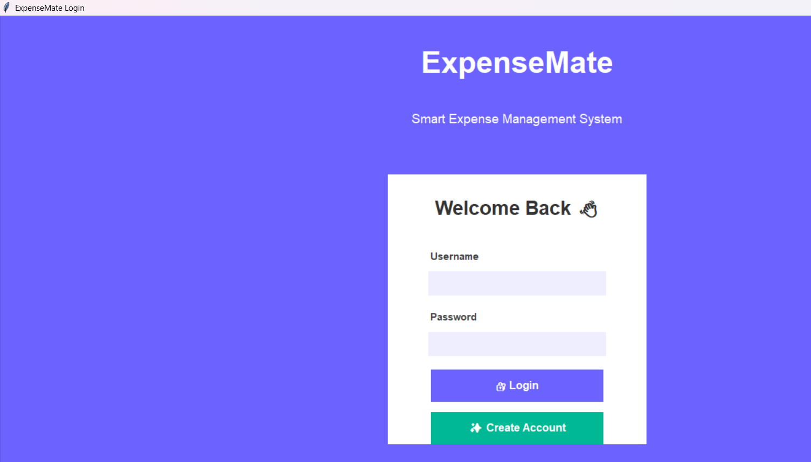
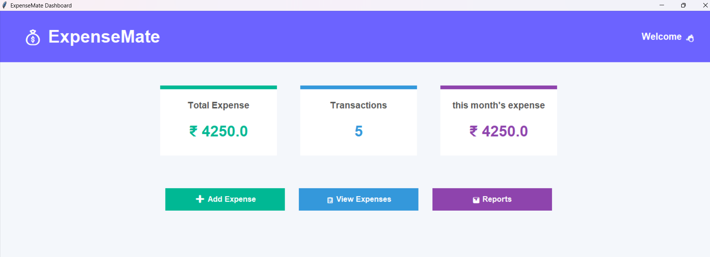
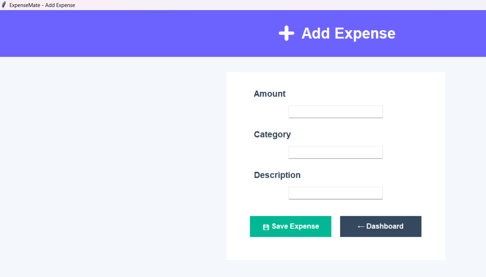
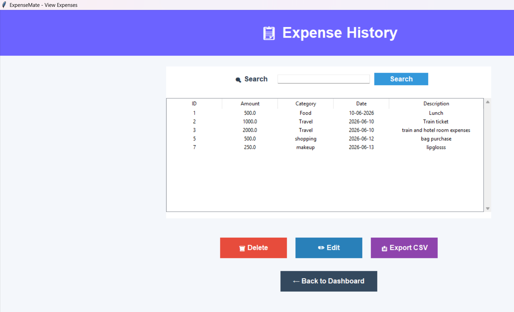

# Personal Expense Tracker 💰

A desktop-based expense management application built using Python Tkinter and SQLite.

## Features

- User Registration and Login
- Secure user-based expense management
- Add expenses
- View expense history
- Search expenses
- Edit expenses
- Delete expenses
- Export expenses to CSV
- Expense analytics using pie charts
- Modern dashboard UI

## Technologies Used

- Python
- Tkinter
- SQLite
- Matplotlib
- Git & GitHub

## How to Run

1. Clone the repository

2. Install dependencies:

pip install matplotlib

3. Run:

python main.py

## Screenshots

### Login Page

### Dashboard

### Add Expense

### View Expenses

### Reports
